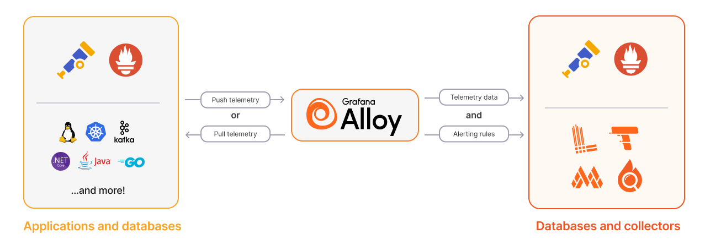

# Grafana Alloy

Grafana Alloyを使ってみたいと思って、調べた内容を記載します。公式ページから拾ってきましたが、
Grafana Alloyは、OpenTelemetry Collectorの柔軟で高性能、ベンダー中立なディストリビューションです。OpenTelemetryやPrometheusといった、最も普及しているオープンソースの可観測性標準と完全に互換性があります。とのことです。

公式の画像を持ってきました。

## Alloyの主な機能
### Collect
Alloyは、120を超えるコンポーネントを使用して、アプリケーション、データベース、Opentelemetryコレクターからテレメトリデータを収集します。Alloyは、Open TelemetryやPrometheusを含む複数のエコシステムを使用した収集をサポートしています。

テレメトリ データは Alloy にプッシュすることも、Alloy がデータ ソースからプルすることもできます。

### Transform
Alloy はデータを処理し、送信用に変形します。

変換を使用すると、テレメトリに追加のメタデータを挿入したり、不要なデータを除外したりできます。

### Write
Alloy は、OpenTelemetry 互換のデータベースまたはコレクター、Grafana スタック、または Grafana Cloud にデータを送信します。

Alloy は互換性のあるデータベースにアラート ルールを書き込むこともできます。

## 導入方法

Grafana Alloyは、以下の方法で導入できます：

1. Grafana Cloud（SaaS）として利用
2. Kubernetes上にHelm Chartを使ってデプロイ
3. Docker Composeを使ったローカル環境での実行

詳細な導入手順については、[クイックスタートガイド](./quick_launch.md)を参照してください。

## 情報
- [サポートされているプラ​​ットフォーム](https://grafana.com/docs/alloy/latest/introduction/supported-platforms/)
- [リソース要件](https://grafana.com/docs/alloy/latest/introduction/estimate-resource-usage/)

## 参考リンク

- [Grafana Labs公式サイト](https://grafana.com/)
- [Grafana Alloy公式ドキュメント](https://grafana.com/docs/)
- [GitHub - Grafana](https://github.com/grafana/grafana)
