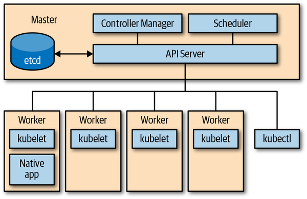
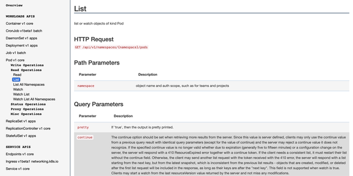
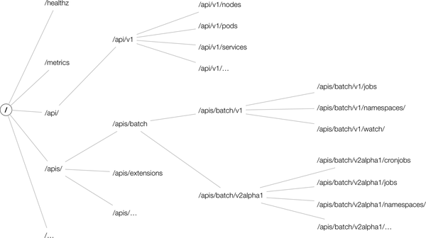
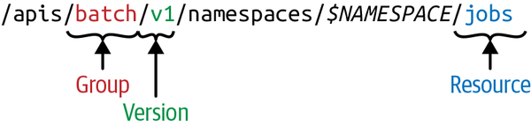

# API基礎（Kind・Resource・GVR/GVK）

Kubernetesのオブジェクトモデルには、独特の語彙がいくつか登場します。まずはこの語彙を整理してから、実際にHTTPパスがどう組み立てられるかを見ていきます。

## APIサーバーとは

Kubernetesのクラスタは複数のノードから構成され、コントロールプレーン（マスターノード）にはAPIサーバー・controller manager・schedulerが存在します。中でも**APIサーバーは、分散ストレージであるetcdと直接やり取りする唯一のコンポーネント**です。



*Figure 2-1. Kubernetes architecture overview（『Programming Kubernetes』より）*

| 図の要素 | 役割 |
|---|---|
| **Master**（コントロールプレーン） | APIサーバー・Controller Manager・Schedulerが動くノード |
| **API Server** | 唯一etcdと直接やり取りするコンポーネント。すべての読み書きの窓口 |
| **etcd** | クラスタの状態を永続化する分散ストレージ |
| **Controller Manager** | Deployment controllerなど各種コントローラを動かし、specとstatusの差分を埋め続ける（reconcile） |
| **Scheduler** | 新しく作られたPodをどのWorkerノードで動かすか決定する |
| **Worker**（図では4つ） | 実際にコンテナが動くノード |
| **kubelet** | 各Workerに1つずつ常駐し、API Serverと通信してそのノード上のコンテナを管理するエージェント |
| **Native app** | クラスタ内で動きながら、自分自身もAPI Serverと直接やり取りするアプリ（後の章で扱うclient-goを使うプログラムなど） |
| **kubectl** | クラスタ外からAPI Serverを叩く、人間向けのCLIクライアント |

図の通り、`kubectl`・`kubelet`・`Native app` はいずれも直接etcdを触ることはなく、**必ずAPI Serverを経由**します。コントロールプレーン内のController ManagerやSchedulerも例外ではありません。

APIサーバーの役割は次の2つに集約されます。

- **Kubernetes APIを提供する**: クラスタ内部（コントロールプレーン自身やワーカーノード、アプリ）からも、外部（`kubectl`など）からも、このAPIを通じてやり取りする
- **クラスタコンポーネントをプロキシする**: ダッシュボードへのアクセスや、ログのストリーミング、`kubectl exec` セッションなど

「APIを提供する」というのは、具体的には次のような操作を指します。

- **状態の読み取り**: 単一オブジェクトの取得、一覧の取得、変更のストリーミング（watch）
- **状態の操作**: 作成・更新・削除

これらの状態はすべてetcdに永続化されます。

## HTTPインターフェース

クライアントから見ると、APIサーバーはJSON（またはprotobuf）をペイロードとするRESTfulなHTTP APIです。次の5つのHTTP verbが使われます。

| verb | 用途 |
|---|---|
| `GET` | 単一リソースまたは一覧の取得 |
| `POST` | リソースの新規作成 |
| `PUT` | 既存リソースの全体更新 |
| `PATCH` | 既存リソースの部分更新 |
| `DELETE` | リソースの削除（復元不可） |

例えば `kubectl -n dev get pods` は、内部的には `GET /api/v1/namespaces/dev/pods` というHTTPリクエストに変換されています。実際のKubernetes APIリファレンスでも、この操作は次のように定義されています。



*Figure 2-2. API server HTTP interface in action: listing pods in a given namespace（『Programming Kubernetes』より）*

APIリファレンスのページには、各操作のHTTPメソッド・パス・パラメータが1つ1つ定義されています。GVR/GVKの概念が分かると、このリファレンスがぐっと読みやすくなります。

APIサーバーが公開しているパス空間は、`/api` と `/apis` を頂点とし、その下にAPI groupやバージョン、Resourceがぶら下がる木構造になっています。`/healthz` や `/metrics` のようにResourceと関係のない特殊なパスも存在します。



*Figure 2-4. An example Kubernetes API space（『Programming Kubernetes』より）*

| ルート直下の分岐 | 何を表すか |
|---|---|
| `/healthz` | ヘルスチェック用の特殊パス。特定のResourceとは無関係 |
| `/metrics` | メトリクス取得用の特殊パス。これもResourceとは無関係 |
| `/api` | **コアグループ**。この下は `/api/v1` のみで、`nodes`・`pods`・`services` などが続く |
| `/apis` | **名前付きグループ**。この下に `/apis/batch` のようなグループ名、さらにその下に `/apis/batch/v1` のようなバージョン、最後に `jobs` などのResourceが続く |

## 用語の整理

- **Kind**: エンティティの型。`Pod` や `Endpoints` のような**Object**（永続的な実体）、`PodList` のような**List**（一覧）、`/binding` や `/scale` のような**特殊用途のKind**の3種類がある
- **API group**: 論理的に関連するKindの集まり。例えば `Job` や `CronJob` は `batch` グループに属する
- **Version**: 各API groupは複数バージョンを持ちうる（`v1alpha1` → `v1beta1` → `v1` と昇格していく）。**同じオブジェクトが「あるバージョンではv1、別のバージョンではv1beta1」というわけではなく、どのバージョンで取得するかをクライアントが選べるだけ**（APIサーバーがロスレスに変換する）
- **Resource**: 小文字・複数形の単語（例: `pods`）で、あるKindに対するCRUD操作を表すHTTPエンドポイント（パス）の集合を指す

Resourceは常にAPI groupとVersionに紐づいており、これをまとめて **GroupVersionResource（GVR）** と呼びます。同様にKindも **GroupVersionKind（GVK）** で識別されます。GVKが実際にどのHTTPパス（GVR）で提供されるかを対応付ける処理を**REST mapping**と呼びます。



*Figure 2-3. Kubernetes API—GroupVersionResource（GVR）（『Programming Kubernetes』より）*

図の矢印が指しているのは、次の3つだけです（`$NAMESPACE` には矢印が付いていない点に注意）。

| 図のラベル | 意味 | この例（`/apis/batch/v1/namespaces/$NAMESPACE/jobs`）での値 |
|---|---|---|
| **Group** | どのAPI groupに属するか | `batch` |
| **Version** | そのAPI groupの何バージョンか | `v1` |
| **Resource** | HTTPエンドポイントとしてのリソース名（複数形） | `jobs` |

**GVR = この3つ（Group + Version + Resource）の組み合わせ**、というのがこの図の言いたいことです。`$NAMESPACE` はパスの一部ではありますが、GVR自体の構成要素ではなく「そのGVRをどの名前空間に対して呼び出すか」という**呼び出し時のスコープ指定**でしかありません。GVKも同じ考え方で、Group・Version・**Kind**（Resourceの代わりにKind）の3つの組み合わせです。

### Cohabitation（複数のAPI groupに存在するKind）

`Deployment` はもともと `extensions` グループのalpha機能として登場し、後に専用の `apps` グループでGAになりました。このように同じ名前のKindが複数のAPI groupに同時に存在する状態を **cohabitation** と呼びます（`Ingress`/`NetworkPolicy` と `extensions`/`networking.k8s.io`、`Event` と core/`events.k8s.io` など）。

## 実際に試してみる: GVR/GVKからHTTPパスを組み立てる

下のデモでは、リソースの種類・namespace・操作（HTTP verb）を選ぶと、実際にAPIサーバーへ送られるHTTPパスとレスポンスのKindがどう決まるかを確認できます。「名前空間スコープのリソース」と「クラスタスコープのリソース」を切り替えて、パスの違いを比べてみてください。

<GvrExplorerDemo />

### 計算の流れ

パスの組み立ては、実際のKubernetes APIサーバーと同じ規則に従っています。

1. コアグループ（`group: ""`）は歴史的経緯から `/apis/core/v1` ではなく **`/api/v1`** 配下に置かれる
2. 名前付きグループは **`/apis/$GROUP/$VERSION`** 配下に置かれる
3. namespaced なリソースは、その後ろに **`/namespaces/$NAMESPACE`** が挟まる（クラスタスコープのリソースにはこれが無い）
4. 最後にResource名（例: `pods`）、単一取得・更新・削除の場合はさらに `/$NAME` が続く

例えば `batch/v1` グループの `jobs` を `default` namespaceで一覧取得すると `GET /apis/batch/v1/namespaces/default/jobs` に、`v1beta1` 版の `cronjobs` を取得すると `GET /apis/batch/v1beta1/namespaces/default/cronjobs` になります。同じ「Job相当」のリソースでも、選んだバージョンによってパスが変わることが確認できるはずです。

## コマンドラインからAPIを覗く

`kubectl proxy` を使うと、認証・認可を肩代わりしてくれるローカルプロキシが立ち上がり、`curl` で直接APIサーバーにアクセスできます。

```bash
$ kubectl proxy --port=8080
Starting to serve on 127.0.0.1:8080

$ curl http://127.0.0.1:8080/apis/batch/v1
{
  "kind": "APIResourceList",
  "groupVersion": "batch/v1",
  "resources": [
    { "name": "jobs", "namespaced": true, "kind": "Job", "verbs": ["create","delete","get","list","patch","update","watch"] }
  ]
}
```

`curl` の代わりに `kubectl get --raw /apis/batch/v1` を使うこともできます。クラスタにどんなリソースがあるか一覧したいときは、次のコマンドが便利です。

```bash
$ kubectl api-resources
NAME         SHORTNAMES   APIGROUP   NAMESPACED   KIND
pods         po                      true         Pod
deployments  deploy       apps       true         Deployment
nodes                                false        Node

$ kubectl api-versions
apps/v1
batch/v1
batch/v1beta1
v1
```

## まとめ

- APIサーバーはetcdと直接やり取りする唯一のコンポーネントで、RESTfulなHTTP APIとしてクラスタの状態を公開している
- Kind・API group・Versionの組み合わせが GVK、Resource・API group・Versionの組み合わせが GVR で、GVRがHTTPパスを一意に決める
- コアグループだけは歴史的経緯で `/api/v1` に、それ以外は `/apis/$GROUP/$VERSION` に置かれる
- 同じKindが複数のAPI group・複数のバージョンに存在することがある（cohabitation、バージョン違い）が、クラスタ内のオブジェクトは1つだけで、どの表現で取得するかをクライアントが選んでいるに過ぎない
