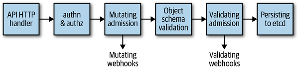

# リクエスト処理と宣言的な状態管理

前ページでは「どのURLに、どんなKindが乗るか」を見てきました。このページでは、そのリクエストがAPIサーバー内部でどう処理されるか、そしてKubernetesの中核的な設計思想である「宣言的な状態管理」について見ていきます。

## APIサーバーがリクエストを処理する流れ

HTTPリクエストがAPIサーバーに届くと、大きく分けて次の3段階の処理が行われます。

1. **フィルタチェーン**: `DefaultBuildHandlerChain()` に登録された一連のフィルタを順番に通過する。各フィルタは、通過すれば情報をcontextに付与し、通過できなければ理由付きのHTTPレスポンス（401や403など）を返す
2. **ルーティング**: パスに応じて、multiplexerが適切なハンドラ（API groupごとに登録されている）にリクエストを振り分ける
3. **ハンドラ処理**: admission・validationを経て、etcdからオブジェクトを読み書きする

フィルタチェーンの主なフィルタは次の順番で並んでいます（`k8s.io/apiserver/pkg` 配下）。

| フィルタ | 役割 |
|---|---|
| `WithPanicRecovery` | パニックのリカバリとログ出力 |
| `WithRequestInfo` | リクエスト情報をcontextに付与 |
| `WithWaitGroup` | Graceful shutdown用にリクエストをwait groupへ登録 |
| `WithTimeoutForNonLongRunningRequests` | watchやproxyを除く通常リクエストにタイムアウトを設定 |
| `WithCORS` | CORS（オリジンをまたいだJSからのアクセス制御）の実装 |
| `WithAuthentication` | リクエストを人間/マシンユーザーとして認証。失敗すると401 |
| `WithAudit` | 監査ログ（送信元IP・ユーザー・namespaceなど）を記録 |
| `WithImpersonation` | `sudo` のようなユーザー偽装（impersonation）の処理 |
| `WithMaxInFlightLimit` | 同時実行中リクエスト数の制限 |
| `WithAuthorization` | RBACなどでアクセス権限をチェック。失敗すると403 |

このチェーンを通過したRESTfulなリクエストは、続けて**次の図の6段階**を順番に通過します。



*Figure 2-5. Kubernetes API server request processing overview（『Programming Kubernetes』より）*

| # | 図の箱 | やっていること |
|---|---|---|
| 1 | **API HTTP handler** | リクエストがAPIサーバーのHTTP処理層に到達する入り口 |
| 2 | **authn & authz** | 「誰か」を確認（認証）→「その操作をしてよいか」を確認（認可）。失敗すると401/403 |
| 3 | **Mutating admission** | オブジェクトの内容を**書き換える**（例: `imagePullPolicy` 未指定時にデフォルト値を補完）。「Mutating webhooks」でクラスタ管理者が独自の書き換えロジックを追加できる |
| 4 | **Object schema validation** | 書き換え後のオブジェクトが**型として正しいか**を機械的にチェック（必須フィールドの有無、DNS互換文字、コンテナ名の重複など） |
| 5 | **Validating admission** | 型ではなく**組織のポリシー的にOKか**を追加チェック。「Validating webhooks」でクラスタ管理者が独自ルール（例: 社内レジストリのイメージのみ許可）を追加できる |
| 6 | **Persisting to etcd** | ここまで全段階を通過したオブジェクトが、ようやくetcdに書き込まれる。更新の場合は他ユーザーが同時に更新していないかを確認する「Optimistic Concurrency」のチェックも行われる |

3〜5が特に混同しやすいポイントです。**3（Mutating）は「直す」フェーズ、4（Object schema validation）は「型として壊れていないか」というKubernetes組み込みの機械的チェック、5（Validating）は「ポリシー的にOKか」というwebhookで差し込める追加チェック**、と役割がはっきり分かれています。

## 実際に試してみる: リクエスト処理パイプライン

下のデモは、`POST` でリソースを新規作成するリクエストが、上の表と同じ6段階（API HTTP handler → authn & authz → Mutating admission → Object schema validation → Validating admission → Persisting to etcd）でどう処理されるかを再現したものです。認証・認可・スキーマ検証・ポリシーチェックをそれぞれ成功/失敗させて、どのステージでリクエストが止まり、どのHTTPステータスが返るかを確認してください。

<RequestPipelineDemo />

### 何が起きたか

このデモは、Figure 2-5の6段階を**順序そのまま**再現しています。認証が失敗すればその時点で401が返り、認可以降のステージは一切実行されません。同様に、認証・認可を通過してもObject schema validationで型として弾かれれば422が、Validating admissionでポリシー違反として弾かれれば400が返り、いずれの場合もetcdには何も書き込まれずに終わります。「後段の処理まで進んで初めて前段のエラーに気づく」ということはなく、**前段のチェックを1つでも通過できなければ、後段の処理は実行されずに即座にエラーが返る**という直列パイプラインになっている点がポイントです。

## 宣言的な状態管理（spec / status）

多くのAPIオブジェクトは、**望ましい状態**（spec）と**現在観測されている状態**（status）を明確に分けて持っています。

- **spec**: `kubectl` やGoコードで指定する「こうあってほしい」という完全な記述。etcdに永続化される
- **status**: controller managerや自作コントローラが管理する「実際は今どうなっているか」という観測結果

例えばDeploymentで「レプリカを20個常に起動しておきたい」と `spec.replicas` に指定すると、controller managerの中のdeployment controllerがそのspecを読み取ってReplicaSetを作成し、ReplicaSetがPodを必要な数だけ作成し、最終的にkubeletがワーカーノード上にコンテナを起動します。レプリカが何らかの理由で失敗すれば、それは `status` に反映されます。

```bash
$ kubectl -n kube-system get deploy/coredns -o=yaml
spec:
  template:
    spec:
      containers:
      - name: coredns
        image: coredns:v1.2.2
status:
  replicas: 2
  conditions:
  - type: Available
    status: "True"
```

**「望ましい状態を宣言し、あとはKubernetesに任せる」**——これが宣言的な状態管理です。ユーザーやコントローラが逐一「Podを1個起動しろ」「今度は2個目を起動しろ」と命令する必要はなく、controllerが継続的に spec と status を見比べて、差分を埋め続けます（この差分を埋め続けるループを **reconcileループ** と呼びます）。

## 実際に試してみる: reconcileループ

下のデモでは、`spec.replicas` を書き換えたり「次のreconcileを1回実行」ボタンを押すことで、コントローラが1ステップずつ状態を収束させていく様子を確認できます。「不安定なクラスタ」モードに切り替えると、ランダムにPodがクラッシュしても、reconcileループが自動的に検知して元の数まで復旧させることが分かります。

<ReconcileLoopDemo />

### 計算の流れ

このデモの `reconcile()` は、実際のコントローラが行っている処理をごく単純化したものです。

1. `status.replicas`（現在のPod数）と `spec.replicas`（望ましいPod数）を比較する
2. `status < spec` なら、不足分のPodを1つ作成する
3. `status > spec` なら、余分なPodを1つ削除する
4. 一致していれば何もしない

これを一定間隔で繰り返し呼び続けるのがコントローラの本質です。Podが外部要因（ノード障害など）でクラッシュしても、次のreconcileで再び差分が検出され、自動的に作り直されます。この「望ましい状態に向けて繰り返し収束させる」という設計のおかげで、Kubernetesは自己修復的（self-healing）に振る舞えます。

## まとめ

- APIサーバーへのリクエストは、認証→（監査/偽装/同時実行数制御）→認可というフィルタチェーンを経てから、Mutating admission→Object schema validation→Validating admission→etcdへの書き込みという6段階のパイプラインに入る
- 各ステージは直列に並んでおり、前段で失敗すれば後段は実行されずに即座にエラーが返る
- Kubernetesのオブジェクトは「望ましい状態（spec）」と「観測された状態（status）」を分けて持ち、コントローラが継続的にreconcileループを回すことで両者を一致させ続ける
- この宣言的な設計により、障害からの自動復旧（self-healing）が実現されている

次の章では、この宣言的な仕組みをGoプログラムから扱うための標準ライブラリ「client-go」を扱います。
