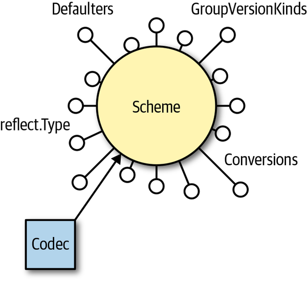
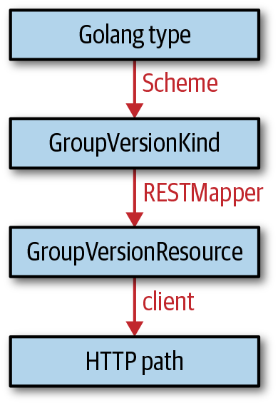

# API Machinery（Kind・GVK・GVR・Scheme）

これまでのページで、Kind・GVK・GVR（[前のセクション](/infrastracture/kubernetes/api/basics)）や、`TypeMeta`・`ObjectMeta`（[Goの中のKubernetesオブジェクト](/infrastracture/kubernetes/client-go/objects-and-clientsets)）を見てきました。このページでは、それらを裏で結びつけている**API Machinery**の中核概念——Kind・Resource・RESTMapper・Scheme——を一つにつなげ、この章の締めくくりとします。

## そもそも「型」とは何か

API Machineryの世界には、実は「型（type）」という用語は正式には存在しません。代わりに使われるのが**Kind**です。

## Kind

KindはAPI groupに分類され、バージョンを持ちます。これをまとめた**GroupVersionKind（GVK）が**、API Machineryの中核的な用語です。

- Goでは、**1つのGVKは必ず1つのGoの型に対応**します
- 逆に、**1つのGoの型が複数のGVKに対応することはあり得ます**（あるGoの型が、複数のバージョンとして登録されるケース）
- Kindは必ずしも1対1でHTTPパスに対応するわけではありません。HTTPエンドポイントを持たないKind（例: webhookの呼び出しに使われる`admission.k8s.io/v1beta1.AdmissionReview`）や、逆に多くのエンドポイントから共通して返されるKind（例: エラー時に返される`meta.k8s.io/v1.Status`）もあります
- 慣習として、KindはCamelCaseで単数形です

## Resource

Kindと並ぶもう1つの軸が**Resource**です。ResourceもAPI groupとバージョンで分類され、これをまとめたものが**GroupVersionResource（GVR）です**。

- **1つのGVRは必ず1つのHTTPパス（の基点）に対応**します。例えば`apps/v1.deployments`というGVRは`/apis/apps/v1/namespaces/$NAMESPACE/deployments`に対応します
- namespaced（Deploymentなど）かcluster-scoped（`rbac.authorization.k8s.io/v1.clusterroles`など）かによって、HTTPパスに`/namespaces/$NAMESPACE`が入るかどうかが変わります（[前のセクション](/infrastracture/kubernetes/api/basics)で扱った内容と同じです）
- 慣習として、Resourceは小文字・複数形で、DNSパスラベルとして有効な形式である必要があります（HTTPパスに直接使われるためです）

## REST Mapping

GVKをGVRに変換する処理を**REST mapping**と呼びます。これを行うGoのインターフェースが**RESTMapper**です。

```go
RESTMapping(gk schema.GroupKind, versions ...string) (*RESTMapping, error)

type RESTMapping struct {
    Resource         schema.GroupVersionResource // このエンドポイントのGVR（場所）
    GroupVersionKind schema.GroupVersionKind     // このエンドポイントに送るGVK（データ形式）
    Scope            RESTScope                    // namespaced/cluster-scopedの情報
}
```

例えば`kubectl get pods`のように、GroupとVersionが省略された「部分的なGVR」しか分からない場合でも、RESTMapperは十分な情報（デフォルトのバージョンなど）を使ってv1のPods Kindに解決できます。クライアントアプリケーションで最も重要な実装は、APIサーバーのdiscovery情報を使って動的にマッピングを構築する`DeferredDiscoveryRESTMapper`（`k8s.io/client-go/restmapper`）です。これはカスタムリソースのような、コア以外のリソースにも対応できます。

## Scheme

もう1つの中核概念が**scheme**（`k8s.io/apimachinery/pkg/runtime`）です。schemeは、**Golangの世界と、実装非依存なGVKの世界を結びつける**ものです。



*Figure 3-6. The scheme, connecting Golang data types with the GVK, conversions, and defaulters（『Programming Kubernetes』より）*

| 図の要素 | 役割 |
|---|---|
| **Scheme**（中心） | Golangの型とGVKなどを結びつける中心的なレジストリ |
| **reflect.Type** | リフレクションで取得した、登録済みのGolangの型 |
| **GroupVersionKinds** | その型が対応する1つ以上のGVK |
| **Conversions** | バージョン間でオブジェクトを変換する関数群 |
| **Defaulters** | 省略されたフィールドにデフォルト値を設定する関数群 |
| **Codec** | Schemeが持つ情報を使って、エンコード・デコード（シリアライズ・デシリアライズ）を行う |

```go
func (s *Scheme) ObjectKinds(obj Object) ([]schema.GroupVersionKind, bool, error)

// 登録の例
scheme.AddKnownTypes(schema.GroupVersionKind{"", "v1", "Pod"}, &Pod{})
```

[Goの中のKubernetesオブジェクト](/infrastracture/kubernetes/client-go/objects-and-clientsets)で見た通り、`runtime.Object`の`GetObjectKind()`が返すGVKは、メモリ上ではほとんど空です。実際にKindやGroupを特定する主役はschemeで、**Goの型をリフレクションで取得し、登録済みのGVKへ変換**します。Kubernetesのコア型については、`k8s.io/client-go/kubernetes/scheme`にあらかじめ全型が登録済みのschemeが用意されています。

## 全体像: Figure 3-7（本章で1つだけ覚えるならこの図）

書籍でも「この章の概念について1つだけ覚えるとしたらFigure 3-7」と明言されている、全体のまとめ図です。



*Figure 3-7. From Golang types to GVKs to GVRs to an HTTP path—API Machinery in a nutshell（『Programming Kubernetes』より）*

| # | 図の箱 / 矢印 | やっていること |
|---|---|---|
| 1 | **Golang type** | 例: `*v1.Pod` というGoの型そのもの |
| → | **Scheme** | reflect.Typeから、登録済みのGVKを引く |
| 2 | **GroupVersionKind** | 例: `{Group: "", Version: "v1", Kind: "Pod"}` |
| → | **RESTMapper** | GVKに対応するGVRを引く（REST mapping） |
| 3 | **GroupVersionResource** | 例: `{Group: "", Version: "v1", Resource: "pods"}` |
| → | **client** | GVR・namespace・nameからHTTPパスを組み立てる |
| 4 | **HTTP path** | 例: `/api/v1/namespaces/default/pods/example` |

## 実際に試してみる: Golangの型からHTTPパスまでを辿る

下のデモでは、Golangの型を選ぶと、Figure 3-7と同じ4段階（Golang type → Scheme → GVK → RESTMapper → GVR → client → HTTP path）を実際に計算して表示します。namespacedな型とcluster-scopedな型を切り替えて、パスの違いを比べてみてください。`Ingress`は複数形が単純な「+s」ではなく`ingresses`になる例です。

<SchemeResolverDemo />

### 計算の流れ

このデモは、[前のセクションのGVR/GVKデモ](/infrastracture/kubernetes/api/basics)で組み立てたHTTPパス生成ロジックを、「Goの型を起点にする」形に拡張したものです。

1. 選んだGoの型に対応する、あらかじめ登録されたGVKを表示する（**Scheme**の役割）
2. そのGVKのGroupとVersionはそのまま、KindだけをResource名（小文字・複数形）に変換してGVRを組み立てる（**RESTMapper**の役割）
3. GVRのGroupが空文字列なら`/api/$VERSION`、そうでなければ`/apis/$GROUP/$VERSION`を基点にし、namespacedなら`/namespaces/$NAMESPACE`を挟み、最後にResource名と名前を続けてHTTPパスを組み立てる（**client**の役割）

普段Goのコードで`clientset.CoreV1().Pods(ns).Get(name, ...)`と書くとき、私たちはこの4段階をまったく意識しません。しかし裏側では、この図の通りの変換が毎回行われています。

## Vendoring（依存関係の管理）について

書籍では、Go 1.12前後の当時主流だった依存管理ツール（`glide`、`dep`、そして当時登場したばかりのGo Modules）ごとに、`k8s.io/client-go`・`k8s.io/api`・`k8s.io/apimachinery`のバージョンをどう揃えるかが詳しく説明されています。ここで言いたい要点は1つだけです。

> **`k8s.io/client-go`・`k8s.io/api`・`k8s.io/apimachinery`の3つは、必ずバージョンの組み合わせを揃える必要がある**（[クライアントの作り方](/infrastracture/kubernetes/client-go/getting-started)で見たバージョニングの通り）。ツール固有の具体的な設定方法は年々変わっていくため、最新の情報は各リポジトリの`go.mod`やREADMEを参照してください。

## まとめ

- API Machineryの世界に「型」という言葉はなく、代わりに**Kind**（GVKで識別）と**Resource**（GVRで識別）という2つの軸がある
- GVKをGVRに変換する処理が**REST mapping**で、それを行うのが**RESTMapper**
- **Scheme**は、Golangの型（reflect.Type）と、GVK・変換関数（Conversions）・デフォルト値設定（Defaulters）を結びつける中心的なレジストリ
- Golang type → (Scheme) → GVK → (RESTMapper) → GVR → (client) → HTTP path、という一直線の変換こそが、この章全体の一番のポイント（Figure 3-7）
- 普段Goのコードでは`clientset.CoreV1().Pods(ns).Get(...)`のように書くだけで済むが、裏側では毎回この4段階の変換が行われている

これでKubernetes APIとclient-goの基礎は一通り終わりです。次はいよいよ、ユーザー定義のリソース（カスタムリソース）を自分で作る話に進みます。
