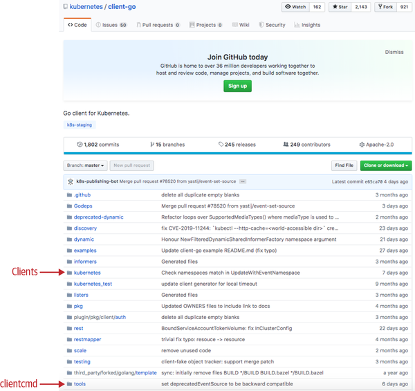
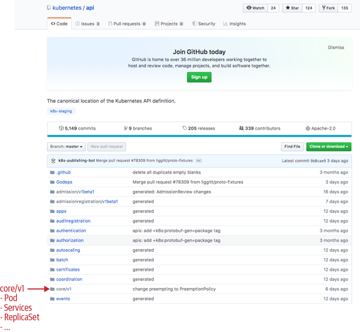
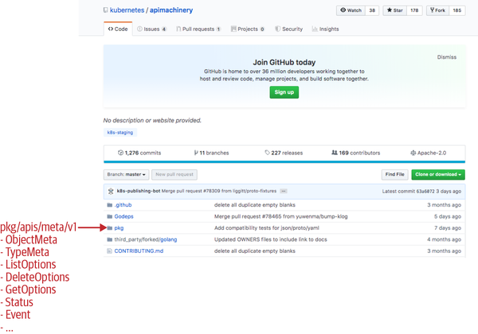
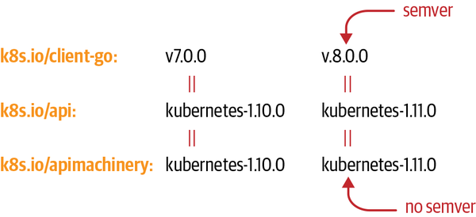

# クライアントの作り方

Kubernetesを操作するGoプログラムは、必ずいくつかの`k8s.io/*`パッケージを組み合わせて作られています。まずはそれぞれのリポジトリが何を持っているのかを整理し、実際にクラスタへアクセスするクライアントを作るところまで見ていきます。

## 3つの中心的なリポジトリ

Kubernetesプロジェクトは、Goプログラムから使うためのリポジトリを`kubernetes`organization配下でいくつも公開しています。取り込むときは `github.com/kubernetes/...` ではなく **`k8s.io/...`** というドメインエイリアスを使います。中でも中心となるのは次の3つです。

### ① client-go — クライアント本体

`k8s.io/client-go`（略してclient-go）は、Create・Get・List・Update・Delete・Patchという通常のREST verbに加えて、Kubernetes特有の **Watch**（変更をストリーミングで受け取る）もサポートするクライアントライブラリです。



*Figure 3-1. The client-go repository on GitHub（『Programming Kubernetes』より）*

| 図の矢印 | 指しているフォルダ | 中身 |
|---|---|---|
| Clients | `kubernetes/` | 実際のKubernetes APIクライアント実装。ここから`clientset`が作られる |
| clientcmd | `tools/`（配下の`tools/clientcmd/`） | kubeconfigファイルを読み込んでクライアント設定を組み立てるパッケージ |

client-goはKubernetes本体と並行してリリースされており、Kubernetes 1.x.yのリリースごとに、対応する`kubernetes-1.x.y`タグのclient-goリリースが存在します。

### ② k8s.io/api — APIオブジェクトのGo型定義

Pod・Service・Deploymentなど、Kubernetesの標準的なAPIオブジェクトのGo型そのものは、client-goとは別の`k8s.io/api`リポジトリに置かれています。



*Figure 3-2. The API repository on GitHub（『Programming Kubernetes』より）*

| 図の矢印 | 指しているフォルダ | 中身の例 |
|---|---|---|
| core/v1 | `core/v1/` | `Pod`, `Service`, `ReplicaSet` など、コアグループ（v1）のGo型定義 |

Podはコアグループ（`v1`）に属するので、Pod型は`k8s.io/api/core/v1`にあります。リポジトリ内の他のトップレベルフォルダ（`apps`、`batch`など）も、それぞれ1つのAPI groupに対応しています。実際のGo型は`types.go`ファイル（例: `k8s.io/api/core/v1/types.go`）に書かれており、それ以外の多くのファイルはコード生成ツールによる自動生成です。

### ③ k8s.io/apimachinery — 型システムの共通部品

`k8s.io/apimachinery`は、Kubernetesのような「APIサーバー方式」を実装するための汎用的な部品を集めたリポジトリです。コンテナ管理に限らず、他のドメイン（例: オンラインショップのAPI）を作るのにも使えます。



*Figure 3-3. The API Machinery repository on GitHub（『Programming Kubernetes』より）*

| 図の矢印 | 指しているフォルダ | 中身の例 |
|---|---|---|
| pkg/apis/meta/v1 | `pkg/`配下の`pkg/apis/meta/v1/` | `ObjectMeta`, `TypeMeta`, `GetOptions`, `ListOptions`, `Status`, `Event` など、あらゆるKindに共通する汎用型 |

## クライアントを作って使う

実際にクラスタへアクセスするコードは、次の3ステップで組み立てます。

1. **kubeconfigを読み込む**: `clientcmd.BuildConfigFromFlags` で、ホームディレクトリの`.kube/config`（`kubectl`が使っているものと同じ）を読み込み、`rest.Config` を得る
2. **クライアントセットを作る**: その`rest.Config`を`kubernetes.NewForConfig`に渡し、`clientset`を得る
3. **リソースにアクセスする**: `clientset.CoreV1().Pods("book").Get("example", metav1.GetOptions{})` のように呼び出す

```go
import (
    metav1 "k8s.io/apimachinery/pkg/apis/meta/v1"
    "k8s.io/client-go/tools/clientcmd"
    "k8s.io/client-go/kubernetes"
)

kubeconfig = flag.String("kubeconfig", "~/.kube/config", "kubeconfig file")
flag.Parse()
config, err := clientcmd.BuildConfigFromFlags("", *kubeconfig)
clientset, err := kubernetes.NewForConfig(config)
pod, err := clientset.CoreV1().Pods("book").Get("example", metav1.GetOptions{})
```

ポイントは、**最後の`Get`呼び出しだけが実際にサーバーへアクセスする**ということです。`CoreV1()`や`Pods("book")`は、その前段でクライアントを選び、namespaceを設定しているだけです（この段階的な組み立て方をbuilder patternと呼びます）。この`Get`は内部的に `GET /api/v1/namespaces/book/pods/example` というHTTPリクエストに変換され、サーバーが200を返せばレスポンスのbodyにJSON（またはprotobuf）でPodオブジェクトが入っています。

クラスタ内のPodの中からこのコードを実行する場合は、kubeconfigの代わりにkubeletが自動でマウントするサービスアカウント（`/var/run/secrets/kubernetes.io/serviceaccount`）を使います。これは`rest.InClusterConfig()`で`rest.Config`に変換できます。実際のコードでは、クラスタ内実行とクラスタ外実行の両方に対応するため、次のように両方を試すパターンがよく使われます。

```go
config, err := rest.InClusterConfig()
if err != nil {
    // フォールバック: kubeconfigを使う
    kubeconfig := filepath.Join("~", ".kube", "config")
    if envvar := os.Getenv("KUBECONFIG"); len(envvar) > 0 {
        kubeconfig = envvar
    }
    config, err = clientcmd.BuildConfigFromFlags("", kubeconfig)
}
```

## バージョニングと互換性

### client-goのバージョンとKubernetesのバージョン

client-go自体はセマンティックバージョニング（semver）を採用していますが、その中身であるGo型のリポジトリ（`k8s.io/api`）と型システムのリポジトリ（`k8s.io/apimachinery`）は、semverではなく**Kubernetesのバージョンそのもの**でタグ付けされています。



*Figure 3-4. client-go versioning（『Programming Kubernetes』より）*

| リポジトリ | バージョンの付け方 | Kubernetes 1.10向け | Kubernetes 1.11向け |
|---|---|---|---|
| `k8s.io/client-go` | **semver** | `v7.0.0` | `v8.0.0` |
| `k8s.io/api` | Kubernetesのバージョン | `kubernetes-1.10.0` | `kubernetes-1.11.0` |
| `k8s.io/apimachinery` | Kubernetesのバージョン | `kubernetes-1.10.0` | `kubernetes-1.11.0` |

client-goのメジャーバージョンは、Kubernetesのマイナーバージョンが1つ上がるごとに1つ上がります（client-go 1.0がKubernetes 1.4向け、以後client-go 12.0がKubernetes 1.15向け、という具合）。このsemverはclient-go自身にしか使われておらず、`k8s.io/api`・`k8s.io/apimachinery`はあくまでKubernetesのバージョンタグで管理されている点に注意してください。

### client-goとクラスタのバージョン互換性

書籍にはclient-goのバージョンとKubernetesクラスタのバージョンの組み合わせごとに、互換性を✓・+・−の3記号で表した表（Table 3-1）が載っています。

- **✓**: client-goとそのKubernetesバージョンが、まったく同じ機能・同じAPI groupバージョンを持つ（対応する組み合わせ）
- **+**: client-goの方が新しい機能やAPI groupバージョンを持っている可能性がある状態。共通している機能（ほとんどのAPI）は問題なく動く
- **−**: client-goがそのKubernetesクラスタと明確に非互換

対応関係は次の通りです（client-go 6.0がKubernetes 1.9に、7.0が1.10に、8.0が1.11に、9.0が1.12に、10.0が1.13に、11.0が1.14に、というように**client-goのメジャーバージョン番号がそのままKubernetesのマイナーバージョンにスライドして対応**しています）。

| client-go | 対応するKubernetes |
|---|---|
| 6.0 | 1.9 |
| 7.0 | 1.10 |
| 8.0 | 1.11 |
| 9.0 | 1.12 |
| 10.0 | 1.13 |
| 11.0 | 1.14 |
| 12.0 / HEAD | （執筆時点でこの表に載っているどのKubernetesバージョンとも完全一致(✓)しない、より新しいバージョン） |

> **表記についての注記**: 元のTable 3-1は、この組み合わせ以外のすべてのマスに「+」または「−」のどちらかが入る、より詳細なマトリクスになっています。ただし今回参照したPDFではこの2つの記号がどちらも同じ見た目で潰れてしまっており、どのマスが「+」でどちらが「−」なのか正確に判別できませんでした。そのため、ここでは判別できる✓（完全一致）の対応関係と、記号そのものの意味だけを載せています。実務では「client-goのバージョンは、接続先クラスタのマイナーバージョンにできるだけ近づける」というのが結論なので、この一言を覚えておけば十分です。
