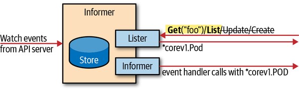

# InformerとWork Queue

前ページで見た`Watch`は強力ですが、そのまま使うのは推奨されません。ここでは、実際のコントローラで標準的に使われる**Informer**と、その後段にある**Work Queue**を見ていきます。

## なぜWatchを直接使わないのか

コントローラが必要になるたびに毎回APIサーバーへ問い合わせると、サーバーに大きな負荷がかかります。かといって`Watch`をそのまま使うだけでは、変更イベントを受け取れても「今このリソースはどんな状態か」を都度サーバーに聞きに行く必要が残ります。

**Informer**は、この2つの課題（負荷とレイテンシ）をまとめて解決する仕組みです。

- APIサーバーからのイベントを受け取り続ける
- その内容をインメモリキャッシュに保持する
- **Lister**という、クライアントに似たインターフェースでキャッシュから読み取れるようにする
- add・update・deleteに対するイベントハンドラを登録できるようにする

## Informerの構造（Figure 3-5）



*Figure 3-5. Informers（『Programming Kubernetes』より）*

| 図の要素 | 役割 |
|---|---|
| **Store** | APIサーバーからのwatchイベントを溜め込むインメモリキャッシュ |
| **Lister** | Storeから読み取り専用でアクセスするインターフェース。`Get`/`List`はできるが、図の通り`Update`/`Create`はできない（書き込みは必ずclient経由） |
| **Informer**（内側の箱） | Storeの変更に応じて、登録済みのadd・update・deleteイベントハンドラを呼び出す部分 |

矢印が示す通り、データの流れは一方通行です。

1. `Watch events from API server` → **Store**（APIサーバーからの変更がキャッシュに書き込まれる）
2. **Store** → **Lister** → 呼び出し元に `*corev1.Pod` 型で `Get`/`List` の結果を返す
3. **Store** → **Informer**（内側） → 登録済みのイベントハンドラを `*corev1.Pod` 型で呼び出す

Listerからの読み取りは**完全にメモリ内で完結し、APIサーバーへのアクセスは一切発生しません**。書き込みたい場合は、Listerではなく（前ページで見た）clientset側のメソッドを使う必要があります。

Informerはエラー処理も高度です。長時間張りっぱなしのwatch接続が切れても自動的に再接続し、イベントを取りこぼしません。もし障害が長引いてetcd側でイベントが既に失われていた場合は、全オブジェクトを`List`し直す**relist**を行います。

さらに、インメモリキャッシュとビジネスロジックを付き合わせるための**resync**という仕組みもあります。設定した周期（数分〜数十分が一般的）が経つたびに、既存の全オブジェクトに対して登録済みのイベントハンドラが再度呼び出されます。resyncは**完全にメモリ内の処理で、APIサーバーへの問い合わせは発生しません**。

## Informerを使ったコード例

```go
import (
    "k8s.io/client-go/informers"
)

clientset, err := kubernetes.NewForConfig(config)
informerFactory := informers.NewSharedInformerFactory(clientset, time.Second*30)
podInformer := informerFactory.Core().V1().Pods()
podInformer.Informer().AddEventHandler(cache.ResourceEventHandlerFuncs{
    AddFunc:    func(new interface{}) { /* ... */ },
    UpdateFunc: func(old, new interface{}) { /* ... */ },
    DeleteFunc: func(obj interface{}) { /* ... */ },
})
informerFactory.Start(wait.NeverStop)
informerFactory.WaitForCacheSync(wait.NeverStop)
pod, err := podInformer.Lister().Pods("programming-kubernetes").Get("client-go")
```

- `informers.NewSharedInformerFactory` で、複数のInformerをまとめて管理する**shared informer factory**を作る
- `AddEventHandler` で、add・update・deleteそれぞれのハンドラを登録する
- `Start` で実際にAPIサーバーへの接続を開始する
- `WaitForCacheSync` で、最初の`List`が終わってキャッシュが埋まるまで待つ
- 最後の`Lister().Pods(...).Get(...)`は完全にメモリ内の操作

> **1リソースにつきInformerは1つだけ**: 1つのバイナリの中で、同じGVRに対するInformerは1つだけ作るのが原則です。`kube-controller-manager`には数十個のコントローラがありますが、Pod用のInformerはプロセス内にたった1つしかありません。これを簡単に実現するのが**shared informer factory**で、複数のコントローラが同じwatch接続を共有できます。手動でInformerを個別に作るのではなく、必ずshared informer factory経由で作成してください。

> **Informerから受け取ったオブジェクトを直接書き換えない**: `Lister`や、イベントハンドラに渡されるオブジェクトはInformerが所有しています。直接書き換えるとキャッシュの整合性が壊れ、デバッグの難しいバグの原因になります。書き換える前に必ず（[前ページ](/infrastracture/kubernetes/client-go/objects-and-clientsets)で見た）ディープコピーをしてください。書き込みはclientset経由で行い、その結果は再びInformerがイベントとして受け取ってキャッシュを更新します。

## Work Queue

Informerが「変化を検知する」仕組みだとすると、**Work Queue**は「検知した変化をどう処理するか」を整理する仕組みです。`k8s.io/client-go/util/workqueue`には、コントローラ実装向けの優先度付きキューが用意されています。

基本のインターフェースはこうです。

```go
type Interface interface {
    Add(item interface{})
    Len() int
    Get() (item interface{}, shutdown bool)
    Done(item interface{})
    ShutDown()
    ShuttingDown() bool
}
```

`Get()`は最も優先度の高いアイテムを返し（利用可能になるまでブロックする）、処理が終わったら`Done(item)`を呼ぶ必要があります。処理中に同じアイテムが再度`Add`された場合は、実際には追加されず「dirtyフラグ」が立つだけで、`Done`が呼ばれた後に再度取り出されます。

この基本インターフェースを拡張したキューが2種類あります。

| 種類 | 追加される機能 |
|---|---|
| `DelayingInterface` | `AddAfter(item, duration)` — 指定した時間後にアイテムを追加できる（失敗時の再試行をホットループにしないため） |
| `RateLimitingInterface` | `DelayingInterface`を拡張し、`AddRateLimited(item)`（レートリミッタの判断に従って追加）・`Forget(item)`（そのアイテムの再試行回数のリセット）・`NumRequeues(item)`（再試行回数の取得）を追加 |

多くのコントローラは`DefaultControllerRateLimiter()`が返すレートリミッタをそのまま使います。これは次のような設定です。

- 5ミリ秒から始まり、失敗のたびに倍増して最大1,000秒まで伸びる指数バックオフ
- 秒間10アイテム・バースト100アイテムを上限とするレート制限

`Forget(item)`は、そのアイテムの処理が成功したときに呼び、バックオフ状態をリセットするために使います。

## まとめ

- `Watch`をそのまま使うのではなく、**Informer**を使うのが標準的な方法。Informerは「インメモリキャッシュ（Store）」「読み取り専用インターフェース（Lister）」「イベントハンドラ登録」の3つを組み合わせたもの
- Listerからの読み取りはAPIサーバーに一切アクセスしない。書き込みは必ずclientset経由で行う
- Informerは1つのGVRにつき1つだけ作るのが原則で、**shared informer factory**を使って複数のコントローラ間で共有する
- Informerが検知した変化をどう処理するかを整理するのが**Work Queue**。レート制限付きの`RateLimitingInterface`が実務でよく使われる

次のページでは、この章の締めくくりとして、Golangの型がどうやってHTTPパスにまでたどり着くのかという**API Machinery**の仕組みを見ていきます。
